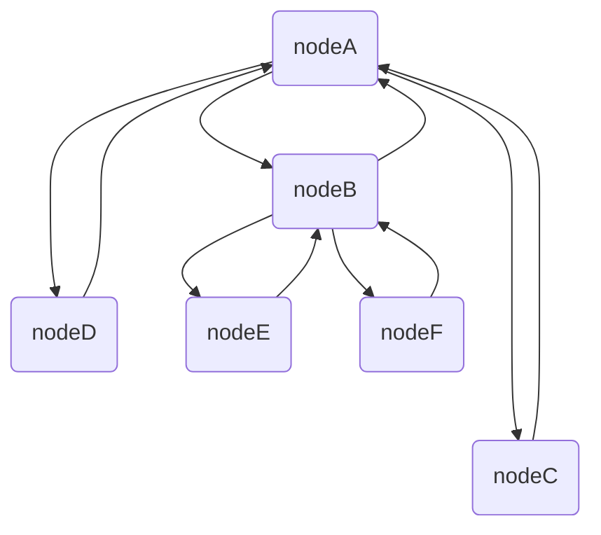

# MMC Document Introduction 

v0.0.1

### MMC Overview

MMC is an open distributed ledger system built upon a public chain architecture with autonomous full-node governance. All network participants enjoy permissionless access to on-chain data, transaction initiation capabilities, and equal rights in consensus decision-making. Featuring cross-chain interoperability through proprietary asset bridging protocols, the platform enables seamless integration of major digital assets including Bitcoin and Ethereum, fostering ecosystem expansion. Its gas fee payment mechanism accepts any ecosystem-compatible token for transaction fee settlement, significantly enhancing economic efficiency.

### MMC Technical Advantages

1. To establish high-performance blockchain infrastructure, MMC has achieved six architectural breakthroughs:
   1. ‌**Instant Transaction Finality**‌
      Powered by a C/C++-based high-performance framework leveraging cross-platform efficiency, MMC achieves sub-second consensus finality (1s network-wide confirmation), delivering institutional-grade transaction throughput.
   2. ‌**Multi-Layer Security**‌
      A hybrid security architecture integrates Verifiable Random Function (VRF), Byzantine Fault Tolerance (BFT), ED25519 elliptic curve cryptography, and proprietary consensus protocols. Decentralized node governance eliminates single points of failure.
   3. ‌**Elastic Scalability**‌
      Dynamic sharding technology and multi-chain parallel processing enable linear throughput scaling. Patent-pending bulk transaction packaging supports enterprise-level application demands.
   4. ‌**Modular Ecosystem**‌
      Customizable sidechain development allows vertical-specific subchains. The mainnet provides standardized API integration for plug-and-play modular functionality across diverse use cases.
   5. ‌**Immutable Ledger**‌
      A globally node-maintained chained encryption structure ensures transaction irreversibility. Data modifications require 51% node verification, mathematically eliminating tampering vectors.
   6. ‌**Full-Chain Transparency**‌
      Real-time transaction synchronization across nodes guarantees complete auditability of address balances and fund flows through decentralized bookkeeping consensus.
   7. ‌**EVM Compatibility**‌
      Native support for Ethereum Virtual Machine (EVM) standards enables deep ecosystem interoperability. Developers can migrate dApps with minimal code adjustments, dramatically reducing smart contract deployment barriers.

## Compilation and Deployment

### Setting Up the Development Environment

Required software packages include:

- gcc （11.2.1-9）
- cmake（v3.21）
- git 
- unzip 
- zip
- autoconf 
- automake 
- libtool
- perl-IPC-Cmd


Dependencies:

- zlib 
- zlib-devel

Commands:

```
yum install -y zlib zlib-devel  
yum install -y unzip zip  
yum install -y autoconf automake libtool
yum -y install perl-IPC-Cmd
yum install -y devtoolset-11-toolchain
scl enable devtoolset-11 bash 
```

`scl enable devtoolset-11 bash   `Set the GCC toolchain to `devtoolset-11`

Upgrade CMake (Note: Ensure CMake version is at least 3.15.x; recommended version is 3.21.x)

```
curl -O https://cmake.org/files/v3.21/cmake-3.21.4.tar.gz
tar zxvf cmake-3.21.4.tar.gz
cd cmake-3.21.4
./configure 
gmake && make install
```

### Program Compilation

Obtain the Source Code

```
git clone https://github.com/memechaintech/memechain.git
```

Compile the Program

```
cd memechain
mkdir build && cd build
cmake .. && make
```

Once the compilation is complete, the main program will be generated in the `bin` directory

Verify CentOS Server Time(To ensure all nodes have synchronized time for reliable transaction processing)

``` 
1.Install NTP
sudo yum -y install ntp

2.Use ntpdate to test NTP
ntpdate pool.ntp.org

3.Check the server time.
date

4.Start the ntpd daemon for continuous time synchronization
systemctl start ntpd

5.Verify if the ntpd daemon is running
systemctl status ntpd
```


### Deploying Nodes

Add the `-c` parameter when starting the program to automatically generate the configuration file

```
cd bin
./memechain -c 
```

Modify `config.json` as needed

```json
{
    "http_callback": {
        "ip": "",
        "path": "",
        "port": 0
    },
    "http_port": 13134,
    "info": {
        "logo": "",
        "name": ""
    },
    "ip": "192.168.1.1",
    "log": {
        "console": false,
        "level": "OFF",
        "path": "./logs"
    },
    "rpc": false,
    "server": [
      "127.0.0.1"
    ],
    "server_port": 13133,
    "version": "1.0.0"
}
```

**"server" Field**: This field should be filled with any IP nodes in the MMC network.

**"server_port" Field**: This field specifies the general network connection port number (default does not need to be changed).

**"log" Field**:

- `"console"` indicates whether logs are output to the screen.
- `"level"` specifies the logging level.
- `"path"` denotes the default path for log generation.

**"ip"**: The system will detect the local IP address at startup and automatically fill this field.

**"http_port"**: The port for the HTTP service.

**"rpc"**: Switch for accessing the interface; enable it to access the interface (default is off).

**"info"**: User-defined logo and name for the node.

**"http_callback"**: HTTP callback interface.

**"version"**: The version of the config file.

| File/Directory | Type      | Description                             |
| -------------- | --------- | --------------------------------------- |
| cert/          | Directory | Storage for generated private key files |
| data.db/       | Database  | Storage for database files              |
| logs/          | Directory | Storage for log files                   |
| config.json    | JSON file | Configuration file                      |

### Starting the Program

Add the `-m` parameter to launch the program and display the menu

```shell
./memechain -m 
```

Overview of menu functions:

| No   | Menu Item        | Function                   |
| :--- | ---------------- | -------------------------- |
| 1    | Transaction      | Initiate Transaction       |
| 2    | Stake            | Delegate Stake             |
| 3    | Unstake          | ‌Unstake                    |
| 4    | Delegate         | Delegate                   |
| 5    | Withdraw         | Withdraw                   |
| 6    | Get Bonus        | Get Bonus                  |
| 7    | PrintAccountInfo | View Account Details       |
| 8    | Deploy contract  | Deploy Smart Contract      |
| 9    | Call contract    | Call Contract              |
| 11   | Lock             | Lock                       |
| 12   | UnLock           | UnLock                     |
| 13   | Proposal         | Submit Governance Proposal |
| 14   | Revoke propos    | Cancel Proposal            |
| 15   | Vote             | Vote                       |
| 16   | Tresury          | Get Fund Rewards           |
| 0    | Exit             | Terminate Program          |


## Basic Functions

##### Accounts

Accounts are responsible for storing user balances. The public key is hashed using Keccak256 to produce a 32-byte hash value. The last 20 bytes, prefixed with 0x, form the account address

##### Multi-Asset Types

Memechain supports cross-chain assets from other blockchains for trading, investment, and gas fee payments at the consensus layer. It is essential to specify which asset type will be used for transactions in this process.

##### **Transaction**

Please choose whether to pay fees with a different asset type (if so, you will need to enter the address and type for the fee payment). Then, input the type of asset you wish to transfer and your account address.

```
Would you like to pay your handling fee separately ? [0] no  [1] yes :1
Please enter the type of asset you want to use to pay the gas:
A
Please enter the fromaddr to pay the gas:
0xCA66A76E2a279050EF6b57797ac53199379abB9F
Please enter the type of asset you want to txAsset:
A
input FromAddress: 0xCA66A76E2a279050EF6b57797ac53199379abB9F
```

Enter the recipient's account address:

```plaintext
input ToAddress: 0xe9E6f91783ADf09cE6FCEbB2A852E953286b1032 
```

Enter the transaction amount; this value can be any number within your account balance. The input value must equal the actual amount of coins:

```plaintext
input amount: 999999 
```

Do you want to check the UTXO status across the entire network? Enter 0 for no (default) or 1 for yes:

```plaintext
Whether to look for network-wide utxo status (1 means yes, 0 means no)
0
```

Enter a description for the transaction; the description cannot exceed 1 KB. Press Enter without inputting anything to skip the description:

```plaintext
Enter a description of the transaction, no more than 1 kb

```


##### **Stake**

Press 2 to enter the staking interface. Please choose whether to pay fees with a different asset type (if so, you will need to enter the address and type for the fee payment). Enter the staking amount; the minimum staking amount is 100,000:

```plaintext
stake addr: 0xCA66A76E2a279050EF6b57797ac53199379abB9F
Would you like to pay your handling fee separately ? [0] no  [1] yes :
0
Please enter the type of asset you want to currency type :
A
Please enter the amount to stake:
100000
```

Do you want to check the UTXO status across the entire network? Enter 0 for no (default) or 1 for yes:

```plaintext
Whether to look for network-wide utxo status (1 means yes, 0 means no)
0
```

Enter a description for the transaction; the description cannot exceed 1 KB. Press Enter without inputting anything to skip the description:

```plaintext
Enter a description of the transaction, no more than 1 kb

```


##### **Unstake**

Press 3 to enter the unstaking interface. Please choose whether to pay fees with a different asset type (if so, you will need to enter the address and type for the fee payment).

Enter the account for unstaking:

```plaintext
Would you like to pay your handling fee separately ? [0] no  [1] yes :
0
Please enter the type of asset you want to currency type :
A
Please enter unstake addr:
0xCA66A76E2a279050EF6b57797ac53199379abB9F
```

Then display the staked UTXO and paste it into the console:

```plaintext
-- Current pledge amount: -- 
utxo: 3f4607d9e1ca341b3bee45110eecd2aaf1be5bba60bbdfe3ca44d68afae1b570
utxo：284607d9e1ca341b3bee28460eecd2aaf1be5zca00bbdfe3ca44d68afae1b637
```

Do you want to check the UTXO status across the entire network? Enter 0 for no (default) or 1 for yes:

```plaintext
Whether to look for network-wide utxo status (1 means yes, 0 means no)
0
```

Enter a description for the transaction; the description cannot exceed 1 KB. Press Enter without inputting anything to skip the description:

```plaintext
Enter a description of the transaction, no more than 1 kb

```


##### **Invest**

Press 4 to enter the investment interface. Please choose whether to pay fees with a different asset type (if so, you will need to enter the address and type for the fee payment). Then, enter your address and select which type of asset you wish to invest in.

```
AddrList:
0xCA66A76E2a279050EF6b57797ac53199379abB9F [default]
Would you like to pay your handling fee separately ? [0] no  [1] yes :
0
Please enter your addr:
0xCA66A76E2a279050EF6b57797ac53199379abB9F
Please enter the type of asset you want to currency type :
A
```

Enter the target address for the investment:

~~~
Please enter the addr you want to invest to:
0xCA66A76E2a279050EF6b57797ac53199379abB9F
~~~

Enter the investment amount (the minimum investment amount is 3,500):

~~~
Please enter the amount to invest:
3500
~~~

Do you want to check the UTXO status across the entire network? Enter 0 for no (default) or 1 for yes:

```plaintext
Whether to look for network-wide utxo status (1 means yes, 0 means no)
0
```

Enter a description for the transaction; the description cannot exceed 1 KB. Press Enter without inputting anything to skip the description:

```plaintext
Enter a description of the transaction, no more than 1 kb

```


##### **Disinvest**

Press 5 to enter the divestment interface. Please choose whether to pay fees with a different asset type (if so, you will need to enter the address and type for the fee payment).

Display the address list and enter the source address for divestment:

~~~
AddrList : 
0xCA66A76E2a279050EF6b57797ac53199379abB9F [default]
Please enter your addr:
0xCA66A76E2a279050EF6b57797ac53199379abB9F
Please enter the type of asset you want to currency :
A
~~~

Enter the target address for divestment:

~~~
Please enter the addr you want to divest from:
0xCA66A76E2a279050EF6b57797ac53199379abB9F
Please enter the type of asset you want to currency :
A
~~~

Enter the UTXO for divestment:

~~~
=====================Current invest amount:===========================
utxo: 366afab7d3931ff5e17cfc25c2dcaf2cf382b8623f22a605c4acc9fbba611dde
=====================Current invest amount:===========================

Please enter the utxo you want to divest:366afab7d3931ff5e17cfc25c2dcaf2cf382b8623f22a605c4acc9fbba611dde
~~~

Do you want to check the UTXO status across the entire network? Enter 0 for no (default) or 1 for yes:

```plaintext
Whether to look for network-wide utxo status (1 means yes, 0 means no)
0
```

Enter a description for the transaction; the description cannot exceed 1 KB. Press Enter without inputting anything to skip the description:

```plaintext
Enter a description of the transaction, no more than 1 kb

```


##### **Bonus**

Press 6 to initiate a claim transaction and automatically claim the amount.

Do you need to pay fees with a different asset type?

**Note:** Only staked accounts can perform claim transactions.

```
Would you like to pay your handling fee separately ? [0] no  [1] yes : 0
```

Do you want to check the UTXO status across the entire network? Enter 0 for no (default) or 1 for yes:

```plaintext
Whether to look for network-wide utxo status (1 means yes, 0 means no)
0
```

Enter a description for the transaction; the description cannot exceed 1 KB. Press Enter without inputting anything to skip the description:

```plaintext
Enter a description of the transaction, no more than 1 kb

```


##### **Deploy contract**

Press 8 to deploy a contract.

1. The compiled contract binary will be saved in the `contract` directory under the `contract` file.
2. Run the node.

Enter the address of the contract deployer:

```plaintext
AddrList : 
0x6a72ad3e9762d67D45a311954CdC6ad4693203a9 [default]
Please enter your addr:0x6a72ad3e9762d67D45a311954CdC6ad4693203a9
```

Do you need to pay fees with a different asset type?

```
Would you like to pay your handling fee separately ? [0] no  [1] yes : 0
```

Do you want to check the UTXO status across the entire network? Enter 0 for no (default) or 1 for yes:

```plaintext
Whether to look for network-wide utxo status (1 means yes, 0 means no)
0
```

Enter a description for the transaction; the description cannot exceed 1 KB. Press Enter without inputting anything to skip the description:

```plaintext
Enter a description of the transaction, no more than 1 kb

```

Specify the contract path; enter 0 to use the contract located at `./contract/contract`.

```plaintext
Please enter contract path : (enter 0 use default path ./contract/contract)
0
```

If the contract constructor requires parameters, enter the binary data for the parameters needed for deployment (if `contract.txt` contains Calldata, you can skip this). Otherwise, enter 0 to skip:

```plaintext
Please enter input data (enter 0 to skip):0
```


##### **Call contract**

Press 9 to execute a contract

Enter the address of the contract executor:

```plaintext
AddrList : 
0x6a72ad3e9762d67D45a311954CdC6ad4693203a9 [default]
Please enter your addr:0x6a72ad3e9762d67D45a311954CdC6ad4693203a9
```

A list of contract deployer addresses will be displayed; enter the contract deployer's address.

```plaintext
=====================deployers======================
deployer: 0x855052fa258B463AEAd1E5abD55F2ffbCBb3F022
deployer: 0xcED97dA085527Fe7e1772CA59Aa1e64A78143128
=====================deployers======================

Please enter to addr:
0xeB3D7EBcc235A5B053F2735B18E16705a82216a3
```

A list of contract addresses will be displayed; enter the address of the contract to execute.

```plaintext
=====================contract addresses=====================
contract address: 0xE5370bF327AC024f0DF1d5d69dcd0B1a45f307B5
=====================contract addresses=====================

Please enter contract address:0xE5370bF327AC024f0DF1d5d69dcd0B1a45f307B5 
```

Enter the parameters for executing the contract:

```plaintext
Please enter args:
0xa0712d680000000000000000000000000000000000000000000000000000000000000001
```

Enter the tip amount for the contract deployer account (default is 0):

```plaintext
input contract tip amount :100
```

Transfer to the contract address; enter 0 if no transfer is needed.

```plaintext
input contract transfer amount :0
```

Transfer to the contract address; enter 0 if no transfer is needed.

```
Would you like to pay your handling fee separately ? [0] no  [1] yes :0
```

Do you want to check the UTXO status across the entire network? Enter 0 for no (default) or 1 for yes:

```plaintext
Whether to look for network-wide utxo status (1 means yes, 0 means no)
0
```

Enter a description for the transaction; the description cannot exceed 1 KB. Press Enter without inputting anything to skip the description:

```plaintext
Enter a description of the transaction, no more than 1 kb

```


##### **Lock**

Press 11 to enter the locking interface. Enter the locking amount (minimum is 10,000), then choose whether to pay fees with a different asset type (if so, you will need to enter the address and type for the fee payment).

```
Lock addr: 0xe9E6f91783ADf09cE6FCEbB2A852E953286b1032
Please enter lock amount: 
10000
Would you like to pay your handling fee separately ? [0] no  [1] yes :
0
```

Do you want to check the UTXO status across the entire network? Enter 0 for no (default) or 1 for yes:

```plaintext
Whether to look for network-wide utxo status (1 means yes, 0 means no)
0
```

Enter a description for the transaction; the description cannot exceed 1 KB. Press Enter without inputting anything to skip the description:

```plaintext
Enter a description of the transaction, no more than 1 kb

```


##### **UnLock**

Press 12 to enter the unlocking interface. Choose whether to pay fees with a different asset type (if so, you will need to enter the address and type for the fee payment), then enter the address for unlocking.

```
Would you like to pay your handling fee separately ? [0] no  [1] yes :
0
Please enter unLock addr:
0xe9E6f91783ADf09cE6FCEbB2A852E953286b1032
```

Enter the UTXO for unlocking:

```
-- Current pledge amount: --
utxo: 826afab7d3931ff5e17cfc25c2dcaf2cf382b8623f22a605c4acc9fbba611cca value:1000

utxo:826afab7d3931ff5e17cfc25c2dcaf2cf382b8623f22a605c4acc9fbba611cca
```

Do you want to check the UTXO status across the entire network? Enter 0 for no (default) or 1 for yes:

```plaintext
Whether to look for network-wide utxo status (1 means yes, 0 means no)
0
```

Enter a description for the transaction; the description cannot exceed 1 KB. Press Enter without inputting anything to skip the description:

```plaintext
Enter a description of the transaction, no more than 1 kb

```


##### **Vote**

Press 15 to enter the voting interface. A list of proposals available for voting will be displayed; enter the proposal you wish to vote on:

```
Vote addr:0xe9E6f91783ADf09cE6FCEbB2A852E953286b1032
Input vote hash: 
826afab7d3931ff5e17cfc25c2dcaf2cf382b8623f22a605c4acc9fbba611cca
```

Enter 0/1 to cast your vote, then enter the address to pay the gas fee:

```
input vote type   ( Against  0, Approve  1 ): 1 
Please enter the fromaddr to pay the gas:
0xe9E6f91783ADf09cE6FCEbB2A852E953286b1032
```

Enter a description for the transaction; the description cannot exceed 1 KB. Press Enter without inputting anything to skip the description:

```plaintext
Whether to look for network-wide utxo status (1 means yes, 0 means no)
0
```

Enter a description for the transaction; the description cannot exceed 1 KB. Press Enter without inputting anything to skip the description:

```plaintext
Enter a description of the transaction, no more than 1 kb

```

##### **Tresury**

Press 16 to enter the treasury reward claiming interface. Choose whether to pay fees with a different asset type (if so, you will need to enter the address and type for the fee payment), and automatically claim the treasury rewards.


##### **PrintAccountInfo**

Press 7 to display account information.


### MMC Blockchain Transaction Rules

#### Basics Concepts

##### 1. Transaction Definition

A transaction is a value exchange between parties mediated by currency and services. In blockchain, a transaction is a digital record that broadcasts transaction data through the network, notifies the transfer of cryptocurrency ownership, and becomes irreversible and tamper-proof through confirmation and validation by consensus mechanisms. Transactions involving regular currencies primarily transfer monetary units or tokens, while actions like placing bids and executing contracts in systems such as domain registration are also recognized as valid transactions.

##### 2. Transaction Requirements

Required conditions vary per transaction, such as sender account address, recipient account address, transaction amount, type of transaction funds (e.g., staking amount), unstaking account, unstaking transactions, etc. Our transaction process is designed to be externally simple and user-friendly.

##### 3. Transaction Categories

Transactions are the exclusive method for blockchain network interactions. Operations including asset issuance, transfers, smart contract deployment, contract calls, and others are all processed through transaction-based mechanisms.

#### Transaction Categories and Operating Guidelines

##### 1.  Basic Transfer Transaction

**Function**‌：Enables peer-to-peer asset transfers

‌**Requirements**‌：

- Valid addresses for both parties 
- Supported asset type
- Account balance ≥ (transfer amount + gas fee)

‌**System Mechanism**‌：

1. Gas fees incentivize node staking and block validation

##### 2. Staking System

###### **Staking Mechanism**‌

- Node stability guarantee: 100,000 MMC minimum stake filters low-quality nodes
- Long-term incentive: Staking amount directly correlates with reward shares
- Risk control: 30-day freezing period for staked assets prevents malicious exits

‌**Function**‌：Network participation eligibility management

###### **Staking Transaction**

‌**Entry Criteria**‌：

- Minimum stake: 100,000 MMC
- Accepted asset: MMC only
- Lockup period: ≥30 days

‌**Reward System**‌：

- Reward weight increases proportionally with staked amount
- Nodes may claim 1%-35% commission rates

###### **Unstaking Transaction**

‌**Procedure**‌：

1. Initiable after ≥30 days of continuous staking
2. Requires original staking transaction hash
3. Funds returned within 24 hours

##### 3. Investment **System**

###### **‌****Investment Mechanism**‌

- Trust network establishment: Requires ≥700,000 MMC investment or cross-chain/bridged external assets to obtain signing rights
- Profit-sharing model: Investors and invested nodes share rewards proportionally
- Ecosystem co-construction: Facilitates value correlation networks between nodes

###### **Investment Transaction**

**Access Rules**:

- Investment Target: Nodes with signing eligibility
- Minimum Investment: 3,500 MMC
- Asset Type: Supports multi-currency investments

**Dividend Mechanism**:

- Rewards are distributed based on the investment ratio

###### Unlocking Investment Transactions

**Operating Requirements**:

- Provide the investment transaction hash.
- Investment duration must exceed 24 hours.
- Confirm the status of the invested node.
- Funds returned within 24 hours

##### 4. Voting System

###### Proposal Transactions

**Permission Requirements**:

- Operations are limited to the genesis account.
- Proposal Types：
  - Add Cross-Chain Assets (Access Proposal)
  - Revocation Proposal: Terminate cross-chain asset interoperability (only allows asset outflows).

**Voting Rules**:‌

- Voting Period: Set by the genesis account.
- Approval Condition: Approval votes must exceed 50%.

###### Voting Transactions

- Voting Eligibility: Validly locked accounts.
- Decision Mechanism:
  - Each account can vote only once per proposal.
  - Effective Time: Voting must occur within the time set for the proposal.
  - Approval Threshold: Approval votes must exceed 50% of total votes.

###### Locking Transactions

**Access Conditions**:

- Minimum Locking: 10,000 Vote
- Asset Type: Vote only
- Locking Period: ≥ 30 days

**Privileges**:

- Gain voting rights for proposals
- Participate in treasury reward distribution

###### Unlocking Transactions

**Operating Process**:

1. Can be operated after the locking period of 30 days.
2. Original locking hash must be provided.
3. Funds returned within 24 hours

##### 5. Reward System

###### Incentive Content‌

- Claim Rewards: Immediate transaction incentives
- Staking Rewards: Returns for long-term network contributions
- Investment Dividends: Rewards for co-building the node ecosystem
- Governance Rewards: Returns for participation in network governance

###### Claim Rewards

**Distribution Mechanism**:

- Daily claims for the previous day's rewards
- Full distribution when the signing compliance rate is ≥ average
- Proportional distribution if below the standard
- Ordinary node investments receive amounts based on proportion

###### Treasury Rewards

**Distribution Mechanism**:

- Source: Total gas fees from the previous day across the network
- Distribution Ratio：
  - 50% distributed based on staking weight (must meet staking + investment thresholds)
  - 50% distributed based on locking weight (must meet locking thresholds)


## Operating Mechanism

------

### Transaction Circulation Mechanism

#### Basic Transaction

​	During the transaction process, a certain number of nodes need to be selected across the entire network. All nodes are selected using the VRF (Verifiable Random Function) algorithm, which adheres to the principles of fairness and randomness.

The election process is as follows:

##### **1. The stage of node election for packaging**

- The initiating node generates a verifiable random number based on the current block height (or specific round parameter) using the **Verifiable Random Function (VRF) algorithm**. This determines the **unique packaging node** responsible for transaction processing, and transmits the pending transaction set to the selected node
- The elected packaging node generates a **zero-knowledge proof** using its local private key to validate the legitimacy of the VRF random number. This step confirms the node's authorized status and ensures the election result remains untampered。

##### **2. Pre-verification stage of the transaction**

- The packaging node re-invokes the VRF algorithm to randomly select multiple verification nodes from the global node pool, then distributes transaction data and VRF proofs in parallel.
- Upon receiving transactions, verification nodes perform dual-layer checks:
  - **VRF Validity**: Verify whether the random number proof generated by the initiating node matches the public key signature.
  - **Transaction Integrity**: Validate transaction signatures, format compliance, and double-spending risks.
- Transactions are marked as pre-confirmed and stored in the packaging node's cache queue when the number of validated nodes reaches the predefined consensus threshold.

##### **3. Block production and global consensus stage**

- The packaging node aggregates pre-confirmed transactions from its cache into a **candidate block** following a predefined structure within fixed time windows.
- **Block Finality Verification**:
  - **Block Structure Validation**:
    Verify critical fields including Merkle root, timestamp, and parent hash.
  - **VRF Proof Chain Traceability**:
    Confirm the packaging node's identity matches the initial election result from the initiating node through VRF proof verification.
- **Network-Wide State Synchronization**:
  When the number of validation-passed nodes reaches the **finality consensus threshold**, the packaging node triggers network-wide broadcast. Non-verification nodes independently validate the VRF proof chain and block content upon receipt, completing ledger synchronization.

Here is the English translation preserving all technical specifications and procedural logic:

------

#### **Contract Transaction Processing**

##### **1. **Contract Dependency-Aware Routing****

- The transaction-initiating node constructs a **dependency graph** based on inter-contract relationships (e.g., cross-contract calls, state variable coupling). Using a **hash-consistent algorithm**, it clusters correlated contracts to the same randomly assigned distribution node, forming transaction clusters.

##### **2.  **Dependency Resolution & Data Restructuring****

- **Topological Order Execution**:The distribution node performs dependency resolution on received contract transactions, building a **Directed Acyclic Graph (DAG)** to eliminate circular dependency risks.
- Contracts with strong dependencies are bundled into **Atomic Transaction Blocks**, ensuring indivisible execution of transactional operations.

##### **3.  **Packaging Node Transaction Handling****

- **Batch Submission Optimization**:
  Restructured contract data blocks are asynchronously batched to the packaging node via dedicated channels, reducing network communication overhead.

##### **4. **Consensus Layer Synchronization****

- **Standardized Process Linkage**:
  Verified and dependency-resolved contract transactions enter the standard consensus workflow, including block generation, validator node election, and network-wide state synchronization.

------

### Synchronization mechanism

Synchronization serves as the core process ensuring node data consistency and network-wide verifiability in blockchain networks. The workflow is implemented through two key mechanisms:

1. **Faulty Node Recovery**

   When nodes experience block inconsistencies due to network or hardware failures, the synchronization protocol rapidly resolves temporary data discrepancies, restoring normal operational status before initiating new transactions.

2. **New Node Onboarding**
   Newly joined nodes bypass full database reconstruction by directly acquiring verified block data from archival devices, significantly reducing synchronization complexity.
   The current MMC Synchronization Framework comprises two modes:

- The current **MMC Synchronization Framework** comprises two modes:
  - **Regular Synchronization**:
    Achieves global state alignment through P2P broadcasting and consensus algorithms.
  - **Ad-Hoc Repair Protocol**:
    Targets localized data anomalies in specific nodes by:
    - Performing **index consistency verification** to rapidly identify and repair problematic blocks
    - Coordinating decentralized data requests with archival devices
      This dual approach eliminates the high costs of traditional full-node storage while maintaining data reliability through cryptographic hash verification.

------

#### **1. Validation Synchronization**

Validation Synchronization serves as the core mechanism for achieving **data consistency** among nodes on the MMC chain. Its operational workflow comprises:

1. **Data Request**:
   Nodes request data at specific block heights from designated nodes via the ​**​Byzantine Fault-Tolerant (BFT) protocol​**​.
2. **Integrity Verification**:
   Upon receiving data, nodes validate its integrity using checksums.
3. **Cache Writing**:
   Verified data is temporarily stored in a cache queue for subsequent batch writing to the database.
   This mechanism applies to ​**​regular block synchronization scenarios​**​, ensuring data reliability through layered validation.

------

#### **2. Rapid Synchronization**

Rapid Synchronization addresses scenarios involving **large-scale block missing** or **network disconnections**, featuring:

1. **Direct Write-In**:
   Bypass block-by-block verification steps and directly write received complete block data into the database.
2. **Emergency Recovery**:
   Rapidly reconstruct the local ledger during network partition recovery or new node onboarding to achieve network consistency.
3. **Performance Optimization**:
   Implement parallel data processing through asynchronous communication mechanisms, reducing synchronization latency.

------

#### **3. Block Repair Protocol**

The Block Repair Protocol acts as a supplementary mechanism to address **chain validation interruptions** caused by missing dependency blocks:

1. **Dependency Detection**:
   Identify node states experiencing validation failures due to missing preceding blocks in the chain.
2. **Targeted Request**:
   Initiate synchronization requests for specific missing blocks to consensus nodes.
3. **Cascading Repair**:
   Re-validate and write the replenished block data into the database following dependency order, restoring ​**​chain structure integrity​**​.

### Security Mechanisms

MMC employs widely adopted and extensively validated algorithms and security mechanisms to protect on-chain assets. The core components include: **ED25519 conic curve signature algorithm** and **Verifiable Random Function (VRF)**.

#### Signature Algorithm

The ED25519 conic curve has achieved extensive validation in both mathematical theory and practical applications. It features:

- **Ultra-fast generation and verification speeds**
- **Maintained security guarantees** while accelerating transaction validation
  For detailed specifications of the ED25519 conic curve, refer to relevant cryptographic literature.

http://ed25519.cr.yp.to/

#### Random Selection Algorithm

MMC extensively employs randomness in transaction processing to ensure fairness. However, conventional randomization methods cannot prevent malicious activities through source code tampering. To address this, MMC integrates **Verifiable Random Function (VRF)** to cryptographically verify the authenticity of generated randomness. For detailed implementation principles, refer to the relevant technical documentation.[Verifiable random function - Wikipedia](https://en.wikipedia.org/wiki/Verifiable_random_function)

## Architecture

### Data Layer

#### Directed Acyclic Graph (DAG) in MMC

Blockchain forking fundamentally arises from the **dynamic imbalance between block generation rate and network broadcast efficiency**, leading to topological structure evolution. When the new block generation speed (denoted as λ) of miner nodes exceeds the propagation velocity (v) of network-wide broadcast confirmation, nodes in different geographical locations continue producing subsequent blocks under partially synchronized states, forming multiple parallel-extending chain branches. This forking probability can be quantified through mathematical modeling:
$$
P_{fork}=1 - e^{-\lambda\tau}
$$
​								    **(λ: block generation rate, τ: broadcast delay)**

**In the model, as λ (block generation rate) increases or τ (broadcast delay) prolongs, the forking probability grows exponentially.**


#### MMC Fork Resolution & Data Processing

The forking phenomenon in MMC inherently results from the dynamic interplay between **distributed network asynchrony** and **consensus mechanism constraints**. 

1. **Double-Spend Detection & Prevention**
   The system automatically identifies and rejects input transactions already confirmed by the main chain through ​**​UTXO state cache comparison​**​. A proprietary model enables efficient tracking of double-spent UTXO states, significantly improving detection efficiency against double-spend attacks.
2. **Validation & Correction**
   During subsequent validation synchronization, erroneous blocks are recovered via Byzantine queries to other nodes. If a significant height disparity exists between erroneous and current blocks, the ​**​Block Repair Protocol​**​ initiates recovery. (Refer to Synchronization Mechanisms)

#### MMC Structural Advantages

1. ##### **Topological Innovation**

   Transforms linear chain structures into **mesh topology**, allowing blocks to reference multiple predecessors simultaneously. This creates parallel validation channels, enabling network throughput to scale linearly with node size.

2. ##### **Concurrent Write Mechanism**

   Enables parallel transaction processing by multiple block producers under consensus protocols. With unchanged block intervals, the network can package **N blocks in parallel**, theoretically increasing transaction capacity N-fold.

3. ##### **Granular Optimization Pathways**

   - **Unit Granularity**: Shifts from block-level packaging to transaction-level processing 
   - **Storage Method**: Replaces global chain storage with localized topological validation, establishing global partial order through **inter-transaction hash references**

### Network Layer

#### Network Infrastructure Design

In MMC, all nodes are **peer-equal** and possess **full node capabilities**.

* **Full Ledger Storage Architecture**
  - **Historical State Archiving**:
    Nodes adopt a ​**​chain storage structure​**​ to retain global state snapshots at each block generation, establishing a traceable chain verification mechanism. Historical data is rapidly located and integrity-verified via ​**​Merkle tree indexing​**​.
  - **Redundancy Assurance**:
    All nodes deploy ​**​distributed databases (RocksDB)​**​ to ensure historical data availability persists through single-node failures.
* **Localized Transaction Validation**
  - **Asymmetric Cryptographic Verification**:
    Transaction signature validation via ​**​ED25519 algorithm​**​, enabling nodes to autonomously verify legitimacy without external services.
  - **Hash Chain Verification**:
    Ensures data immutability by validating chained relationships between current block hashes and predecessor block hashes. Each transaction execution automatically triggers validation logic in the local ​**​smart contract sandbox environment​**​.
* **Decentralized Broadcast Network**
  - **P2P Real-Time Synchronization**:
    Nodes construct broadcast networks via TCP connections, achieving full-network coverage for new transactions/blocks within minimal latency.
  - **Hierarchical Propagation Optimization**:
    Implements ​**​multi-layer network diffusion protocols​**​ with message priority queuing to prevent congestion.

- **Dynamic Node Synchronization Protocol**
  - **Auto-Discovery Mechanism**:
    New nodes acquire initial peer lists through seed nodes during startup.
  - **Incremental Sync Strategy**:
    Intelligently selects ​**​rapid sync​**​ (full data import) or ​**​validation sync​**​ (block-by-block hash verification) based on block height disparity, supporting resumable transfers and parallel downloads.
- **Standardized Query Interfaces**
  - **Real-Time Status API**:
    Provides low-latency queries for current block height, transaction pool status, and node topology.
  - **Historical Data Indexing**:
    Enables conditional searches via transaction hashes with rapid result returns.

- #### **Node Governance Framework**

  ##### **1. Node Uniqueness Identification & Authenticity Verification**

  - **Cryptographic Fingerprint Generation**:
    Generates globally unique node IDs via ​**​asymmetric cryptography (ED25519)​**​, combining node public keys and timestamped hash values to prevent identity forgery.

  - Dynamic Validator Pool Construction:

    Selects qualified nodes into the validator pool based on:

    - Node staking amount
    - Historical behavior scoring
    - Network stability tests
      Updates reputation weights in real-time via smart contracts, deactivating low-reputation nodes.

  - **Random Selection Algorithm**:
    Employs ​**​Verifiable Random Function (VRF)​**​ with discrete random distribution, generating random seeds via node private keys to prevent allocation bias caused by network latency.

  ##### **2. Node Quantity Limits & Dynamic Adjustment**

  - **Optimal Performance Range**:
    MMC achieves peak performance with ​**​500-1,000 nodes​**​. Beyond this threshold, communication overhead grows exponentially, causing consensus delays and resource contention.
  - **Dynamic Load Management**:
    Monitors real-time computational load (CPU/memory usage), automatically flagging overloaded nodes as "unavailable" until resources free up.
  - **Staking Threshold Mechanism**:
    Enforces minimum staking requirements for network participation, prioritizing removal of low-stake nodes during congestion.

  ##### **3. Anti-Attack Mechanisms**

  - **Byzantine Fault Tolerance Threshold**:
    Dynamically calculates maximum tolerable malicious nodes based on network scale, mitigating single-point attacks via redundant validation and multi-round consensus.
  - **Economic Incentive-Penalty System**:
    Distributes rewards proportional to contributions while penalizing malicious acts, creating a ​**​positive feedback loop of honest participation​**​.

  ##### **4. Node Update & Broadcast Protocol**

  When nodes receive requests:

  - **Metadata Logging**:
    Captures sender IP, block height, public key address, and other metadata.
  - Registry Update:
    - Refreshes status for existing nodes
    - Triggers admission checks (hardware specs & network version) for new nodes
  - **Broadcast Synchronization**:
    Propagates updates via gossip protocol to maintain ​**​network topology consistency​**​.

#### **Core Network Protocol Stack**

##### **1. Fully-Connected Architecture Design Principles**

- **Performance Advantages**:
  The fully-connected topology achieves ​**​high throughput​**​ and ​**​low latency​**​ via direct P2P communication, eliminating relay bottlenecks inherent in traditional hierarchical networks.
- **Reliability Assurance**:
  Redundant links between nodes eliminate single points of failure. Network continuity persists through multi-path broadcasting even if partial nodes fail.

##### **2. TCP Peer-to-Peer Communication Foundation**

MMC implements node-to-node communication through a **fully-connected TCP protocol**, ensuring stability via:

- **Message Buffer Queues**:
  Temporarily store received messages in memory buffers to mitigate instantaneous traffic spikes.
- **Transaction Dispatcher Scheduling**:
  Allocate tasks to processing threads using priority algorithms (e.g., timestamp-based ordering).
- **Asynchronous Processing Handlers**:
  Deploy dedicated modules for parallelized execution of transaction validation and block synchronization.

##### **3. Long-Term Stability Mechanisms**

- **Modular Scalability**:
  Supports ​**​hot-swappable sub-module designs​**​, enabling capacity adjustments without service interruption to adapt to dynamic network scaling.

##### **4. Communication Performance Optimization**

- **Message Compression**:
  Reduces network latency using ​**​zlib algorithm​**​-based compression.
- **Traffic Shaping**:
  Implements congestion prevention through prioritized bandwidth allocation strategies.




------

* Here is the English translation preserving technical processes and workflow logic:

#### **Core Network Workflow Examples**

##### **1. TCP Registration Process**

1. The registration-initiating node sends a registration request to the target node. If no connection exists between them, a connection is first established. Failed connections trigger registration reinitiation.
2. The target node processes the registration request and returns specific node information.
3. The registration-initiating node handles the response and records the received node information.

##### **2. Node List Maintenance Workflow**

plaintext

Copy

```plaintext
Receive request → Parse sender information → Verify staking status → Update/Add node → Broadcast to neighbor nodes  
```

##### **3. Communication Routing Decision Logic**

- **Direct Communication**:
  If the target node exists in the local routing table, use end-to-end transmission.
- **Relay Forwarding**:
  For nodes absent from the routing table, establish tunnel connections via relay nodes.

##### **4. Block Height Change Notification Process**

- When a node's block height changes, it sends its updated height to all connected nodes. Receiving nodes process the height update request and refresh the corresponding node's block height.

### Consensus Layer

#### Consensus Protocol

##### Consensus Protocol Architecture

MMC employs a **Non-Computational Competition Protocol** at the consensus layer, designed to eliminate the energy inefficiencies of traditional Proof-of-Work (PoW). It achieves efficient validation rights allocation through **node identity authentication** combined with **randomized selection mechanisms**.

##### Node Identity Framework

1. **Unique Identification Mechanism**
   Each participating node is assigned a ​**​globally unique node ID​**​ during registration, ensuring traceability and uniqueness across the network.
2. **Dynamic Validator Selection**
   Periodically generates validator node sets via a ​**​cryptographically secure discrete random number algorithm​**​. This process uses Verifiable Random Functions (VRF) to ensure fair selection, preventing centralized pre-selection or stake concentration.

#### Consensus Process

##### Node Roles

In the MMC network, node roles are **dynamic and function-oriented**, determined by their **temporary responsibilities** during a transaction lifecycle rather than fixed identities. Roles include:

1. **Initiating Node**
   - **Transaction Initiation**: Creates transaction requests and transmits them to packaging nodes.
2. **Packaging Node (Proposer)**
   - **Organization & Packaging**: Aggregates transactions into blocks.
   - **Process Orchestration**: Submits packaged blocks to validation nodes and broadcasts finalized blocks based on feedback.
3. **Validation Node (Candidate Proposer)**
   - **Block Verification**: Validates block compliance and integrity.
   - **Feedback**: Returns verification results (approval/rejection) to packaging nodes.
4. **Other Nodes**
   - **Passive Synchronization**: Receive and store validated blocks via network broadcasts without active processing.

##### Consensus Process

The **innovative consensus mechanism design** addresses the **hashrate monopolization** and "winner-takes-all" flaws inherent in traditional Proof-of-Work (PoW) systems. Its core advantages include:

1. **Balancing Fairness & Efficiency**
   - Eliminates energy-intensive hashing competitions by adopting a **CPU-friendly algorithm**, inherently resisting GPU/ASIC hardware specialization to lower entry barriers and resource centralization risks.
   - Distributes validation rights through **collaborative coordination** rather than zero-sum competition, preventing minority control over ledger maintenance.
2. **MMC Network Elastic Scalability**
   - **Parallel processing capacity** scales linearly with validator node growth.
   - **Low-energy architecture** and distributed node availability ensure **marginal cost reduction** post-scale deployment, enabling cost-efficiency for high-frequency transaction scenarios.
3. **Sustainable Cost Control**
   - Validators require only **basic computational resources (CPU)**, reducing hardware/operational costs by orders of magnitude compared to PoW.
   - **Dynamically adjusted validator pools** distribute network loads, mitigating localized congestion-induced cost fluctuations.

##### On-Chain Confirmation

Traditional blockchains are constrained by **fixed block generation intervals** and **block size limits** (e.g., BTC's 10-minute/1MB design), resulting in high transaction confirmation latency and low throughput efficiency, which fail to meet high-frequency application demands.

1. **Unlimited Transaction Packaging**
   MMC enables ​**​unlimited transaction capacity per block​**​, combined with optimized distributed validation workflows, achieving ​**​confirmation speeds as fast as 0.1 seconds​**​ while maintaining data security and decentralization.
2. **Dynamic Consensus Threshold**
   Sets ​**​75% network-wide node consensus​**​ as the block validity criterion. This threshold, empirically validated, balances ​**​confirmation speed​**​ and ​**​fault tolerance rate​**​, avoiding efficiency loss from excessive thresholds or security compromises from insufficient ones.
3. **Self-Healing Mechanism for Failed Transactions**
   If block broadcasting fails to reach the 75% threshold, the network detects anomalies via ​**​automated synchronization protocols​**​, triggering participating nodes to validate and rollback disputed blocks, ensuring ledger consistency and purging invalid transactions.

Here is the precise English translation preserving all technical specifications and incentive mechanisms:

------

### Incentive Layer

#### Reward Mechanisms

##### Reward Claim

1. **Eligibility Criteria**
   Users must satisfy:
   - Completed network authentication
   - Cumulative investments from other nodes ≥700,000 MMC
2. **Reward Distribution Pathways**
   - **Delayed Rewards**:
     Claim additional rewards from the daily pool based on signature count, distributed between ​**​investor signers​**​ (funding nodes) and ​**​execution signers​**​ (signing nodes) via preset ratios.

##### Reward Annualized Rate Calculation Rules (Beta | Weekly 0.1% Decrement)

|  Week  | 2025 Annualized Rate (YI) |
| :----: | ------------------------: |
|   1    |                      0.23 |
|   2    |                     0.229 |
|   3    |                     0.228 |
| ...... |                  ........ |

| Week   |      n Annualized Rate (YI) |
| :----- | --------------------------: |
| ...... | 0.15 (Min. annualized rate) |

##### Treasury Rewards

Treasury rewards target two qualified node types:

- **Locked-Asset Nodes** (require MMC staking)
- **Packager Nodes** (meet block packaging requirements)

Daily rewards are sourced from total network Gas fees, allocated as:

1. Locked-Asset Weight Reward (50%)
2. Packager Contribution Reward (50%)

Rewards are distributed via **MMC coin minting** directly to nodes' local accounts, arriving in real-time with no vesting period. Daily allocation from Gas fee pools follows:

| Allocation Dimension  |                           Formula                            | Reward Share |
| :-------------------: | :----------------------------------------------------------: | :----------: |
|  Locked-Asset Weight  | `(Node-locked assets / Total network-locked assets) × Treasury Gas × 50%` |     50%      |
| Packager Contribution | `(Node packaging count / Total network packaging count) × Treasury Gas × 50%` |     50%      |

#### Burn Mechanism

Token burning involves transferring assets to **irreversible addresses** (e.g., `0x000...`) for **permanent supply elimination**. This operation via smart contracts or protocol logic ensures assets are unretrievable, achieving **supply reduction** and **deflationary control**.

In MMC, burning serves as a **governance tool** to deter nodes from spamming **invalid/malicious transactions** (e.g., Gas fee farming). Partial burning of offenders' tokens effectively suppresses such behavior while maintaining **economic fairness** and **sustainability**.

#### Gas Calculation

To prevent consensus divergence in fee accounting, MMC adopts **localized independent calculation**:
`Gas = Transaction byte stream length × Per-byte Gas rate (default: 1000)`

This **real-time byte metric model** quantifies data transmission loads, aligning resource consumption with network capacity.

### Contract Layer

#### **MMC Smart Contract Development Framework**

- Language & Execution Environment

  Utilizes Solidity as the core development language, compatible with mainstream standards including ERC-20/721/3525. Built on an optimized EVM virtual machine

   with enhanced features:

  - Precision-optimized transaction metering units
  - Restructured block variable access permissions
  - Hybrid account address management system

#### **Dev Toolchain Configuration**

- **Compilation**: Remix IDE with integrated debugging tools

- **Verification**: EVM opcode-level bytecode verification mechanism

- Resources:
  - [Solidity Documentation](https://docs.soliditylang.org/en/latest/)
  - [EVM Opcodes](https://ethervm.io/)
  - [Solidity Examples](https://solidity-by-example.org/)

#### **Performance Optimization Benchmarks**

Compared to the Ethereum mainnet, MMC achieves:

- **Reduction in Gas costs**
- **Second transaction finality**
- **Parallel processing capacity scaling**

#### **Technology Roadmap**

MMC's smart contract system is exploring **cross-chain interoperability protocols**, planning **WASM virtual machine integration** via modular architecture to enable seamless multi-chain contract ecosystems. The current testnet provides a contract sandbox environment where developers can deploy and debug directly via contract toolchains.

### Application Layer (DApp Ecosystem)

## Advanced

### Performance Metrics

#### 1. Transaction Processing Efficiency

1. **Comprehensive Throughput (TPS)**
   TPS measures a blockchain's ​**​instantaneous transaction processing capacity​**​, reflecting its end-to-end ability to validate, package, and confirm transactions per unit time. Key contextual factors:
   - **Baseline variations**: Test environments must define node count, transaction types (e.g., simple transfers vs smart contracts), and block validation mechanisms.
   - **Real-world vs theoretical peaks**: Ethereum 1.0 mainnet achieves lower TPS than lab environments.
   - **On/off-chain coordination**: Layer-2 solutions (e.g., Lightning Network) boost TPS but introduce centralization trade-offs.
2. **Throughput Dynamic Balancing**
   Distinguish ​**​submitted transactions​**​ (network ingress pressure) from ​**​confirmed transactions​**​ (consensus efficiency). Example: Bitcoin processes ~300K daily transactions but faces throughput drops during peaks due to 1MB block limits.
   Optimization strategies:
   - Atomic storage write optimizations: Minimize per-transaction resource usage via compact data structures.
   - Parallel validation: Implement parallel smart contract runtime environments like Solana's Sealevel.

#### 2. Temporal Performance Dimensions

1. **Transaction Lifecycle Latency**
   Three-phase delays:
   - **Submission delay** (user broadcast → mempool)
   - **Packaging delay** (mempool → block inclusion)
   - **Finality delay** (irreversible on-chain confirmation)
   - PoW benchmarks: Bitcoin averages 6-block depth confirmation delays.
   - PoS breakthroughs: Algorand achieves 4-second finality; Avalanche sub-second pre-confirmations.
   - Network topology impact: P2P broadcast efficiency determines cross-node synchronization speed.
2. **Block Generation Cycle Tuning**
   Balance ​**​network stability​**​ and ​**​user experience​**​ via block time design:
   - Long cycles: Bitcoin prioritizes fork resistance and robustness.
   - Short cycles: Solana's 400ms blocks + Tower BFT enable high throughput but increase hardware fault risks.
   - Dynamic adjustment: Ethereum 2.0's variable block times adapt to network load.

#### 3. System Robustness Evaluation

1. **Decentralization Degree Quantification**
   Validator count/distribution determines attack resistance:
   - DPoS limitations: EOS's 21 super nodes sacrifice decentralization for efficiency.
   - Incentive innovations: Filecoin's Proof-of-Storage expands validator base.
   - Geographic compliance: Polkadot mandates cross-continent validator distribution.
2. **Energy Efficiency Paradigms**
   Consensus mechanism energy ratios vary exponentially:
   - PoW case: Bitcoin's high per-transaction energy cost.
   - PoS advances: Cardano's Hydra solution targets million-TPS efficiency.
   - Hybrid models: BSV's unlimited block scaling reduces per-transaction energy.

#### 4. Engineering Practice Guidelines

1. **Development Compatibility**
   Prioritize beyond raw metrics:
   - EVM compatibility depth: Avalanche C-Chain and Polkadot Moonbeam offer full Ethereum dev ecosystems.
   - State storage costs: NEAR's sharded storage reduces smart contract data overhead.
   - Regulatory alignment: Hedera Hashgraph provides compliance-ready infrastructure.
2. **Cost-Benefit Modeling**
   Build composite metrics including:
   - **Transaction fees**: Ethereum's EIP-1559 fee market vs Solana's fixed fees.
   - **State storage costs**: NEAR's storage staking model.
   - **Cross-chain costs**: Polkadot's parachain slot auctions for resource allocation.

### Synchronization

#### **Byzantine Fault Tolerance (BFT)**

The theoretical foundation of Byzantine fault-tolerant algorithms originates from the distributed system fault tolerance model proposed by Leslie Lamport and others, which reveals the mathematical boundary for achieving consensus in asynchronous communication environments through the abstract "Byzantine Generals Problem"—when the total number of nodes in the system satisfies **N ≥ 3f + 1** (where **f** represents the maximum number of malicious nodes), even if **f** nodes intentionally transmit conflicting information or refuse to cooperate, the remaining honest nodes can still reach consistent decisions through specific message exchange mechanisms, with the realization of this fault tolerance relying on cryptographic signature verification and multi-round message broadcasting; however, due to the **O(n^(f+1))** exponential growth characteristic of communication complexity with increasing node count, traditional Byzantine algorithms often face performance bottlenecks in practical blockchain networks exceeding hundreds of nodes, making early distributed systems difficult to directly apply this theory. In the engineering practice of the MMC blockchain, designers adaptively reform the classical Byzantine fault-tolerant model through hierarchical validation mechanisms and dynamic node selection strategies: the system periodically collects block height information broadcast by all nodes at fixed time windows, identifies the mainstream chain height accounting for over 50% through statistical clustering algorithms as the synchronization baseline, and when a local node detects its own height is below this baseline, it first filters at least three high-reputation nodes with historical synchronization success rates exceeding 95% from the token-staking-verified node pool, acquires and cross-compares block header hash values from these nodes’ corresponding height intervals, triggers the Merkle tree verification process if over two-thirds of nodes return identical hash values, then employs a random polling mechanism to shard and download complete block data from the validated node subset; for incremental synchronization with block height differences within 100 blocks, the system further executes sandbox replay of transaction scripts and topological validation of the UTXO state tree—this design that separates metadata verification from business logic validation not only inherits the Byzantine fault tolerance theory’s defensive capabilities against malicious nodes but also circumvents collusion attack risks potentially caused by fixed validator sets in traditional methods through the introduction of a Verifiable Random Function (VRF)-based dynamic node selection mechanism, ultimately establishing a dynamic balance between communication efficiency and security.

#### **Implementation of Byzantine Fault Tolerance in the Project**

In the MMC network, the system periodically triggers synchronization state detection based on preset time windows, determines the mainstream chain baseline value across the network by statistically analyzing the latest block heights broadcast by a majority of nodes, and automatically activates the synchronization protocol when local nodes detect their current chain height falls below this baseline: first, at least 25 validation nodes meeting the minimum staking threshold are selected from the staking node pool, their corresponding block header hash sets within specific height intervals are acquired in parallel, and cross-verification is performed using a Merkle root comparison algorithm; if over two-thirds of nodes return completely consistent hash sequences, the system initiates sharded block data requests to the validated node group, employs a random weighted algorithm to select optimal data sources for block body downloads, and for incremental synchronization scenarios with block height differences below 100 blocks, refines the synchronization process into transaction-level verification by replaying transaction scripts step-by-step in a sandbox environment and validating the UTXO state tree topology, ensuring data integrity and logical consistency before executing chain state merging.

#### **Why Synchronization is Essential in the Project**

Synchronization serves as the **state consistency assurance mechanism** between nodes in distributed networks, ensuring all participants maintain identical ledger copies through data exchange and verification; in blockchain systems, synchronization and consensus form a complementary relationship:

- **Synchronization Layer**: Responsible for transaction dissemination and block propagation, guaranteeing network-wide accessibility of transactional data;
- **Consensus Layer**: Validates blocks and confirms chain states based on synchronized data to achieve eventual consistency.

MMC achieves high-efficiency synchronization and resource optimization through its **event-driven block generation mechanism** (producing blocks only when transactions exist) and **dynamic node selection protocol**, laying the foundation for high throughput.

During runtime, blockchain nodes periodically broadcast their highest block height to peers; upon receiving broadcasts, nodes compare the received height with their local height—if lagging behind, they initiate block download procedures. Block downloads follow a "request/response" model: nodes entering the download phase randomly select qualified peers to send requests for specific block height ranges, and nodes receiving such requests respond with corresponding blocks based on the query content. MMC's synchronization guarantees **network-wide data consistency**, provides a secure foundation for consensus, and ensures the **security and robustness** of the MMC network.

### DAG Structure

#### **Nature and Classification of DAG Structure Pruning (Forks)**

##### Core Definitions

The DAG structure pruning (forking) in MemeChain fundamentally arises from structural divergences in distributed ledger systems caused by protocol changes, manifested as nodes diverging in their criteria for determining block validity. Based on compatibility between old and new protocols, forks are categorized into two types:

1. ###### **Soft Fork** (Protocol-Restrictive Upgrade)

   - New rules are passively compatible with legacy nodes, achieving functional iteration by narrowing the boundaries of originally valid operations (e.g., Bitcoin SegWit).
   - Key characteristics: No mandatory network-wide upgrades required; eventual convergence to a single main chain.

2. ###### **Hard Fork** (Protocol-Expansive Upgrade)

   - New rules are entirely incompatible with legacy protocols, causing node splits into independently operating parallel chains (e.g., ETH/ETC split).
   - Key characteristics: Mandatory network-wide upgrades; permanent chain divergence otherwise.

#### Technical Evolution Comparison

|       Dimension        |                          Soft Fork                           |                          Hard Fork                           |
| :--------------------: | :----------------------------------------------------------: | :----------------------------------------------------------: |
| Protocol Compatibility |            Backward-compatible with legacy nodes             |            Mutually incompatible between versions            |
|  Upgrade Enforcement   |                   Gradual upgrades allowed                   |           Mandatory network-wide upgrades required           |
|  Data Structure Scope  | Limited to redefining existing field functionalities (e.g., Bitcoin version-bit rule changes) | Supports field extensions and structural redesigns (e.g., BCH 8MB block expansion) |
|       Risk Level       |               Low (chain stability preserved)                |   High (potential community splits & hashrate competition)   |

#### **In-Depth Analysis of Fork Generation Mechanisms**

##### Technical Triggers

1. ###### **Protocol Layer Upgrade Conflicts**

   - Nodes diverge on consensus rule modification directions (e.g., Bitcoin block size debates).
   - Ambiguous field redevelopment (e.g., extending Bitcoin's ScriptPubKey for smart contracts).

2. ###### **Network Layer Anomalies**

   - **UTXO double-spend attacks**: Network latency causes the same UTXO to be spent multiple times.
   - **Block synchronization delays**: Miners simultaneously discovering valid blocks create temporary state forks (State Fork).

#### Fork Management Strategies

##### **Preventive Mechanisms**

- **Real-time Byzantine Fault Tolerance (BFT) Monitoring**: Detects node data consistency via Practical Byzantine Fault Tolerance (PBFT) mechanisms, triggering alerts when over **1/3 of nodes** exhibit abnormal data.
- **UTXO State Pre-Validation**: Verifies UTXO validity before transactions enter the mempool, blocking double-spend transaction broadcasts.

##### **Recovery Mechanisms**

- **Missing Block Retrieval**: Nodes request missing block data through P2P networks, supplementing local chains after Merkle tree verification.
- **Invalid Block Removal**: Automatically switches to the longest valid chain upon detecting forks based on the **"Longest Valid Chain Rule"**.

#### **Empirical Case Studies of Notable Forks**

##### **Soft Fork Exemplar: Bitcoin SegWit Upgrade**

- **Technical Approach**: Separated transaction signature data from main blocks, enhancing throughput via extended data structures.
- **Compatibility**: Legacy nodes retained transaction validation capabilities but couldn’t access new features like Lightning Network.
- **Outcomes**: Block effective capacity increased by **1.7×**, transaction processing speed rose to **14 TPS**.

##### **Hard Fork Exemplar: Ethereum The DAO Incident**

- **Trigger**: Fundamental community disagreement over reversing $60M ETH theft.
- Chain Comparison:
  - **ETH Chain**: Implemented transaction rollbacks and transitioned to Proof-of-Stake.
  - **ETC Chain**: Maintained "code is law" principles and Proof-of-Work.
- **Market Impact**: ETH market cap grew **380%** post-fork within 6 months; ETC retained its niche.

#### **Fork Governance Insights**

1. **Protocol Design Foresight**
   Reserve version number fields (e.g., Bitcoin’s `nVersion`) as upgrade identifiers for future rule iterations.
2. **Balanced Community Governance**
   - **Hierarchical Voting**: Miners, developers, and token holders participate in upgrade decisions via weighted voting.
   - **Transition Periods**: Implement compatibility windows (e.g., Ethereum’s 3-month Berlin upgrade phase).
3. **Risk Mitigation Strategies**
   - **Fork Contingency Plans**: Predefine chain rollback and hashrate migration protocols.
   - **Cross-Chain Interoperability**: Reduce liquidity risks post-fork via atomic swap protocols.

------

#### **Topological Characteristics & Validation Mechanisms of DAG Architecture**

The Directed Acyclic Graph (DAG) redefines distributed ledger data organization through hash pointer-based multi-directional validation dependencies—each new transaction node must validate and reference multiple predecessor transactions upon creation (e.g., IOTA’s mandatory validation of two historical transactions), forming a non-cyclic mesh topology. This design overcomes the verification efficiency bottlenecks of blockchain’s linear structure while ensuring strict temporal sequencing via topological sorting algorithms, decoupling transaction validation from global serial consensus into localized parallel confirmations. Unlike Merkle trees’ rigid single-parent hierarchies, DAG enables dynamic multi-path validation, creating self-organizing data flow networks. Crucially, DAG maintains global ledger consistency through unidirectional hash constraints and timestamp anchoring, avoiding cyclic chaos inherent in traditional directed graphs.

#### **Performance Breakthroughs & Commercial Potential of DAG**

By eliminating block packaging and directly writing transactions as atomic units, DAG delegates validation duties to transaction initiators (replacing miners), decoupling throughput from block size/consensus intervals. Real-world implementations achieve **100× higher TPS** than traditional blockchains (e.g., Nano’s 1000+ TPS) with near-zero transaction costs due to absent miner fees. While blockchains balance decentralization and security via PoW/PoS, their scalability ceilings (e.g., Bitcoin’s 7 TPS peak) persist. DAG’s localized validation parallelism unlocks disruptive potential in IoT micropayments and cross-border settlements, though weak consistency models require vigilance against double-spend attack detection inefficiencies.

#### **Technical Challenges & Evolution of DAG**

DAG faces core issues like **transaction finality delays** and **centralized bootstrapping dependencies**—initial low-activity phases rely on foundation nodes (e.g., IOTA’s Coordinator) until transaction density surpasses security thresholds. Probabilistic confirmation mechanisms dependent on cumulative validation path weights risk state rollbacks during topological reorganizations. Current solutions integrate **checkpoint mechanisms** (periodic authority snapshots) and **weight accumulation algorithms** to resist double-spends. Future advancements may combine **zero-knowledge proofs** and **sharding** to enhance consistency and attack resistance without sacrificing throughput.

### Cryptographic Hash Functions

Cryptographic hash functions, serving as the core technology for data integrity verification, deterministically convert inputs of arbitrary length into fixed-length outputs (typically 256-bit hexadecimal strings), with their essential characteristics manifested as collision resistance (the inability to find two distinct inputs producing identical hash values) and the avalanche effect (minimal input alterations causing drastic output changes). The SHA-256 algorithm, selected as the standard hashing engine due to its quantum-computing attack resistance and computational efficiency balance, generates unique digital fingerprints for transaction data through hashing—any tampering during transmission causes deviations between the recipient’s computed hash and the original fingerprint, enabling millisecond-level tamper detection. This technology not only underpins Merkle tree construction (for batch transaction verification in blocks) but also provides data anchoring for digital signatures, ensuring bit-level consistency of signed objects during transmission.

### Digital Signatures

Digital signature mechanisms based on asymmetric cryptographic systems achieve triple guarantees of identity authentication, data integrity, and non-repudiation through complementary operations of private key signing and public key verification. Validator nodes derive the sender’s public key by parsing the recovery identifier (v-value) within the signature, then decrypt the signature using this public key and compare the decrypted result against the transaction hash. This ensures attackers cannot forge valid signatures (requiring solving the elliptic curve discrete logarithm problem, ECDLP), while irrevocably binding transactions to sender identities—any repudiation attempts can be traced and verified through on-chain signature records.

### Consensus Mechanisms

Blockchain consensus mechanisms act as state synchronization engines for decentralized networks, coordinating nodes’ agreement on transaction ordering and ledger states through predefined rules. MMC’s consensus protocol innovatively integrates Verifiable Random Functions (VRF) with a Proof-of-Stake (PoS) weighted model: during each block generation cycle, the system probabilistically selects validator nodes from the staking pool based on weighted criteria, followed by Byzantine fault-tolerant validation of candidate blocks through multi-linear broadcast protocols (requiring signatures from over two-thirds of nodes). Compared to the energy-intensive mining of traditional Proof-of-Work (PoW) and the wealth concentration flaws of PoS, the protocol achieves fair validator rotation via cryptographic randomness while optimizing consensus communication complexity through threshold signature techniques—maintaining 51% attack resistance while compressing transaction confirmation latency to seconds, with testnet-measured throughput reaching 200 TPS.

### Smart Contracts

#### **Smart Contract Technical Architecture**

Smart contracts are auto-executing protocol systems built on blockchain technology, essentially comprising verifiable program code residing on distributed ledgers. By translating contractual terms into deterministic algorithmic logic, they enable third-party-free automated fulfillment mechanisms, leveraging cryptography to ensure transaction irreversibility and consensus-based validation to guarantee immutable execution outcomes.

#### **Core Characteristics**

- **Structured Code Specifications**: Contract code developed using Turing-complete programming languages eliminates natural language ambiguities through logical constraints, with all operations transparently synchronized across nodes to support real-time state tracking and historical auditing.
- **Deterministic Execution Mechanisms**: Upon meeting predefined trigger conditions, smart contracts autonomously activate execution modules, permanently recording consensus-verified outputs on-chain—a process excluding human intervention to form closed-loop fulfillment guarantees.
- **Anti-Default Protection Systems**: Blockchain’s distributed validation requires attackers to compromise over 51% of nodes, exponentially increasing breach costs, while full-cycle transaction traceability reinforces accountability.
- **Privacy Preservation Paradigms**: Anonymization through zero-knowledge proofs (ZKPs) and ring signature mechanisms ensures compliance-auditable transactions while isolating entity identities, with public-private key systems enabling precise control over operational permissions and data visibility.

